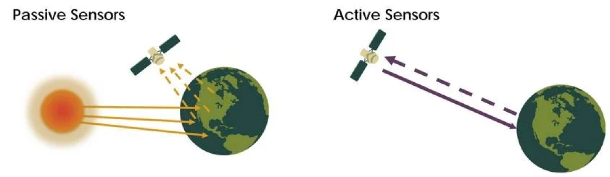

In this week's lecture, we learned the introductory concepts of remote sensing. Remote sensing is a non-contact observation technology that allows information to be collected without directly touching the target. It relies on sensors mounted on satellites or aircraft to receive and record electromagnetic waves that are emitted or reflected by objects, which makes it possible to identify and extract features of the Earth's surface. Because remote sensing can obtain large-scale surface information, it has great potential for addressing public issues.

# 1.1 Summary
## 1.1.1 Comparison between passive and active sensors

{width="90%" fig-align="center"}

| Dimension | Passive sensor | Active sensor |
|:---|:---|:---|
| **Target of Detection** | Reflected sunlight or emitted thermal energy | Backscattered echoes from self-emitted pulses |
| **Content** | Chemical/Biological (e.g., chlorophyll, water, temp) | Physical/Structural (e.g., height, roughness, shape) |
| **Data Representation** | Multi/Hyper-spectral imagery (Photo-like) | Grayscale intensity images, Point clouds ($Z$ values) |
| **Typical Satellites** | Landsat, Sentinel-2, MODIS | MODIS	Sentinel-1 (SAR), ICESat-2 (LiDAR) |
| **Benefits** | Rich spectral information, high thematic accuracy | All-weather/All-day, precise height/structure information |
| **Limitations** | Weather-dependent (blocked by clouds/rain) | Complex processing, non-intuitive interpretation |

 **Table 1: Comparison between active and passive sensors** 

## 1.1.2 Resolutions
In this section, we learned that remote sensing data and their applications may vary due to differences in four types of resolution. When focusing on a specific research question, it is often necessary to sacrifice accuracy in some aspects of the data in order to achieve higher precision in another aspect. For example, if we want to study remote sensing data with high temporal frequency, MODIS data can be a suitable choice. However, this also means giving up some spatial resolution. The spatial resolution of MODIS ranges from 250 m to 1000 m, which is much coarser than that of Landsat or Sentinel data. In summary, selecting remote sensing data is essentially a process of balancing different advantages and limitations. 

| Feature | **Spatial Resolution** | **Spectral Resolution** | **Temporal Resolution** | **Radiometric Resolution** |
|:---|:---:|:---:|:---:|:---:|
| **Definition** | The actual area covered by a single pixel on the ground (e.g. 30m, 1m) | Number of bands recorded by sensors and their band width (narrowness) | The frequency with which a sensor revisits and acquires data for a specific location | The sensitivity of a detector to small differences in electromagnetic energy (Bit-depth) |
| **Core Question** | How small an object can we see? | Can we distinguish between similar materials? | How often can we observe changes over time? | How many levels of intensity (grayscale) can be recorded? |
| **Applications** | Urban planning, Object detection, Precision agriculture | Vegetation health, Mineral mapping, Water quality analysis | Disaster monitoring, Crop growth tracking, Deforestation | Differentiating subtle features in shadows or deep water |
| **Limitation** | High resolution leads to massive data volume and narrow swath width | High spectral resolution often requires a trade-off with coarser spatial resolution | Frequent revisits often result in lower spatial detail or off-nadir distortion | High bit-depth requires sophisticated sensors and increased storage/bandwidth |

 **Table 2: Four resolutions** 

# 1.2 Application
# 1.2.1 Band and Synthetic image
In this session, I'd like to choose Beijing as an example to explore remote sensing data at a local scale. The data are loaded into the software for preliminary processing, and the meanings of different spectral bands and their composite images are examined. In addition, the reflectance characteristics of different land cover types are analyzed.

In this case, raster data from a selected area in Beijing are used, with acquisition dates on 30 July 2025 and 1 January 2026. From the comparison below, it can be clearly observed that in the true color composite, there is a significant difference in vegetation coverage between summer and winter in Beijing. In the false color composite, since vegetation reflects near-infrared radiation, large areas appear red in summer images, while only limited red areas can be observed in winter images. 

::: {layout="[[50, 50]]" layout-valign="bottom"}

:::

::: {layout="[[50, 50]]" layout-valign="bottom"}

:::

# 1.2.2 Tasseled caps
The Tasseled Cap Transformation is a method that reduces the dimensionality of remote sensing data and highlights important features. It combines multiple spectral bands into new components with clear physical meanings. For example, brightness shows the overall reflectance of the surface, greenness is related to vegetation density, and wetness reflects moisture conditions.

In this case, I only focused on a selected area in Beijing and did not include the mosaicking process of multiple raster datasets. 

Since I could not use SNAP, the analysis was carried out in QGIS. The main steps are as follows. First, the vector boundary and raster data were imported and clipped to the study area. Second, the 10 m bands (such as B2, B3, B4, and B8) were resampled to 20m. Third, band maths was used to calculate brightness, greenness, and wetness. Finally, these components were combined to produce the final image.

Overall, this method makes multi-band data easier to understand and is helpful for beginners to explore remote sensing data.

::: text-center
**Brightness=0.3037(B2)+0.2793(B3)+0.4743(B4)+0.5585(B8)+0.5082(B11)+0.1863(B12)

Greeness=-0.2848(B2)-0.2435(B3-0.5436(B4)+0.7243(B8)+0.0840(B11)-0.1800(B12)

Wetness=0.1509(B2)+0.1973(B3)+0.3279(B4)+0.3406(B8)-0.7112(B11)-0.4572(B12)**
:::

{width="90%" fig-align="center"}

| Dimension | Description |
|:---|:---|
| **Key Components** | **Brightness**: Total reflectance; **Greenness**: Biomass/Vegetation vigor; **Wetness**: Moisture content in soil/canopy. |
| **Advantages** | **Data Reduction**: Compresses multi-band data into 3 axes; **Physical Interpretation**: Direct proxy for bio-physical parameters; **Noise Reduction**. |
| **Limitations** | **Sensor-Specific**: Coefficients vary by sensor (S2 vs L8); **Atmospheric Sensitivity**: Requires surface reflectance (Level-2A) data. |
| **Case Studies** | **Urban Growth**: Mapping impervious surfaces; **Agriculture**: Drought/Stress monitoring; **Ecology**: Land cover classification. |

 **Table 3:Tasseled caps** 

# 1.3 Reflection

