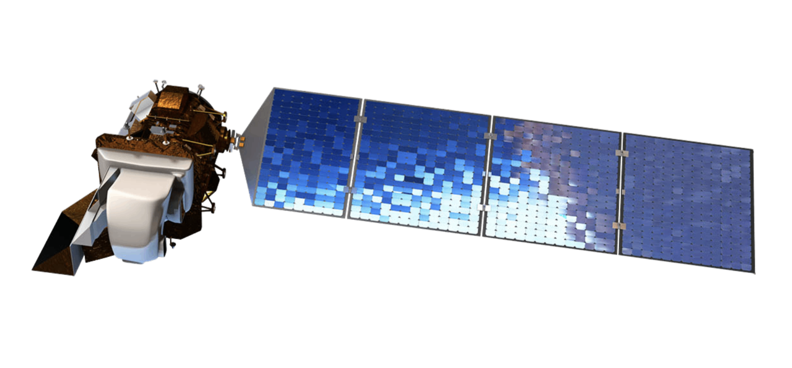
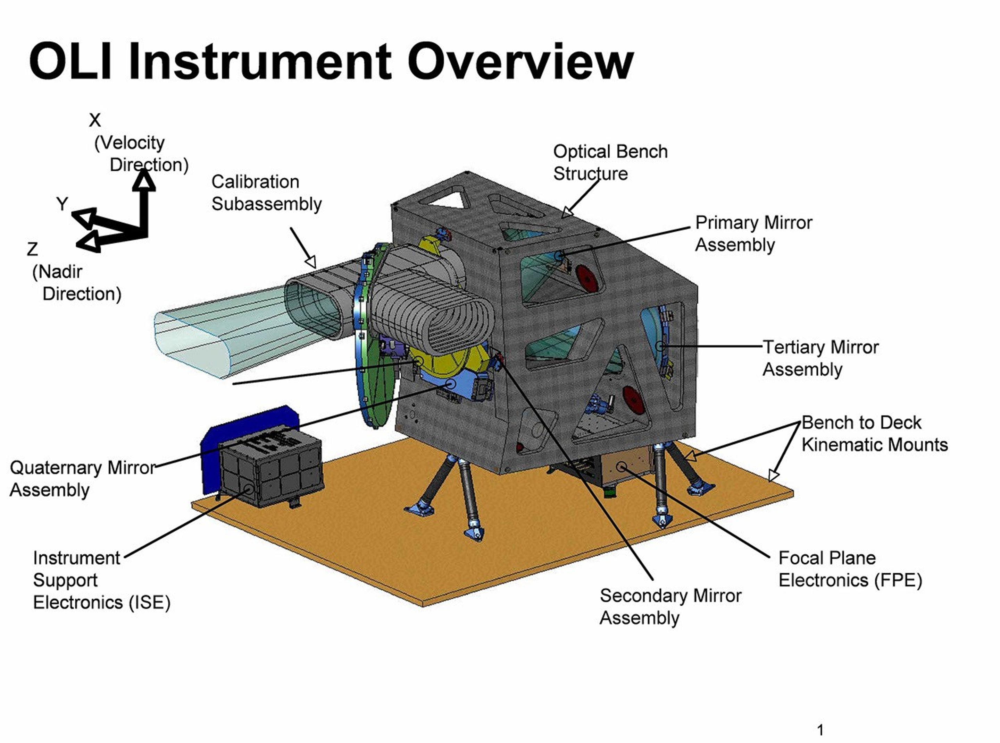

```{r xaringan-extra, echo=FALSE}
# 激活面板集功能
xaringanExtra::use_panelset()
```

# Introduction: The Evolution of OLI

### What is the Operational Land Imager?

.pull-left[
* **The Primary Payload:** OLI is the lead optical sensor onboard Landsat 8/9.
* **Legacy:** Succeeding the ETM+ sensor (Landsat 7).
* **Technological Leap:** Shifted from **Whisk-broom** to **Push-broom** (fixed linear arrays).
    * Result: Higher Signal-to-Noise Ratio (SNR).

> "OLI is a calibrated radiometer measuring Earth with precision."
]

.pull-right[
<a href="https://geonarrative.usgs.gov/landsat-8/">
  
</a>

<p style="font-size: 0.6em; text-align: center; margin-top: 10px;">
  Figure 1: Landsat 8 (Source: <a href="https://geonarrative.usgs.gov/landsat-8/">USGS</a>)
</p>
]

---
# Technical Summary: OLI Sensor Performance

.panelset[
.panel[.panel-name[Spectral Bands]
**Core Capability:** OLI captures data in 9 spectral bands, providing a significant upgrade over previous Landsat sensors.

* **VNIR (Visible/Near-Infrared):** Bands 1-5. Includes a new **Coastal Aerosol (Band 1)** for shallow water and aerosol studies.
* **SWIR (Short-wave Infrared):** Bands 6-7. Essential for moisture content and geological mapping.
* **Cirrus (Band 9):** A specialized band designed for **Cloud Detection**, allowing for cleaner data processing by identifying high-altitude thin clouds.

> The addition of the Cirrus band (1.37 µm) is a critical innovation for OLI. It solves a long-standing issue in remote sensing where thin clouds were often mistaken for land features, thus increasing the reliability of automated land-cover classification.
]

.panel[.panel-name[Spatial Resolution]
**Definition:** The level of detail captured in each pixel of the OLI imagery.

* **Multispectral (Bands 1-7, 9):** **30 meters**. This is the "gold standard" for long-term global change studies, balancing detail with file size.
* **Panchromatic (Band 8):** **15 meters**. This high-resolution black-and-white band is used for **Pan-sharpening**, a process that merges the color of the 30m bands with the detail of the 15m band.

>**Purpose in Research:** 30m resolution is ideal for monitoring **Urban Expansion** or **Deforestation**. While higher resolution (e.g., 10m Sentinel-2) exists, OLI's 30m data maintains the historical consistency needed for 40+ year time-series analysis.
]

.panel[.panel-name[Temporal Resolution]
**Definition:** How often the sensor revisits the exact same location on Earth.

* **Revisit Time:** **16 days**. 
* **Global Coverage:** OLI images the entire Earth every 16 days on a sun-synchronous orbit.
* **Constellation Advantage:** With **Landsat 8 and 9** both carrying OLI sensors in the same orbit (offset by 8 days), the combined temporal resolution is effectively **8 days**.

]
]

---
# OLI Instrument

.pull-left[
* **Scan Mechanism:** Replaced the oscillating scanning mirror (Whisk-broom) with long linear arrays of detectors (Push-broom).
* **Reliability:** Eliminated the "Scan Line Corrector" (SLC) failure risks seen in Landsat 7.
* **Radiometric Quality:** Longer **Dwell Time** leads to:
    * Higher Signal-to-Noise Ratio (SNR).
    * Improved sensitivity to land-cover changes.

> "The push-broom design allows OLI to capture 70,000 detectors simultaneously, providing a cleaner, more stable image."
]

.pull-right[
<a href="https://science.nasa.gov/mission/landsat/oli/">
  
</a>

<p style="font-size: 0.6em; text-align: center; margin-top: 10px;">
  Figure 2: OLI (Source: <a href="https://science.nasa.gov/mission/landsat/oli//">USGS</a>)
</p>
]

---

# Benefits and Limitations

.panelset[
.panel[.panel-name[Benefits]
1.**Superior SNR (Signal-to-Noise Ratio):** 

The push-broom design increases dwell time on the ground, delivering exceptionally clear images with minimal noise in dark or shadowed areas.

2.**High Radiometric Resolution (12-bit):** 

With 4,096 grey levels, OLI prevents pixel saturation in extremely bright scenes (like glaciers) and preserves intricate details in dark terrains.

3.**Advanced Cloud Screening (Band 9):** 

The dedicated Cirrus band allows for the precise detection and removal of thin, high-altitude clouds that typically interfere with land-cover analysis.

]

.panel[.panel-name[Limitations]

1.**Coarse Spatial Resolution (30m):** 

While ideal for regional monitoring, its 30m resolution is often insufficient for distinguishing individual urban features like narrow streets or small buildings.

2.**Temporal Latency (16-day Revisit):** 

A 16-day revisit cycle is too slow to capture rapid environmental shifts, such as the peak of a flash flood or immediate post-fire changes.

3.**Sensor Striping Risks:** 

The complex alignment of thousands of detectors in the linear array requires rigorous calibration to avoid vertical "striping" artifacts in the final imagery.
]

]

---

# Application

## 1.Lithological identification and mineral mapping

### Research Overview

**Objective:** Discriminating lithological formations and mapping alteration zones in the Igoudrane region, Morocco.

**Problem:** Traditional field mapping in rugged, arid terrains is costly and time-consuming.

**Methodology:** Integration of **Band Ratios (BR)**, **PCA**, and **Independent Component Analysis (ICA)** using Landsat-8 OLI data.

> "OLI's spectral precision allows for the identification of iron oxides and hydroxyl minerals with high spatial consistency."

.footnote[Source: <a href="https://www.cell.com/heliyon/fulltext/S2405-8440(23)04571-1" style="color: #0000EE; text-decoration: underline;">Soukaina Baid et al. (2023)</a>]


---

# Application

## 1.Lithological identification and mineral mapping

### OLI Performance

**Band Involvement:** * **VNIR (B2, B4):** Exploited via $4/2$ ratio to highlight ferric iron (hematite/goethite).

> **SWIR (B6, B7):** Critical for detecting hydroxyl-bearing minerals (clay/micas) via $6/7$ ratio.
    
**Results:** Successfully delineated hydrothermally altered rocks, validated by **XRD analysis**.

**Key OLI Feature:** **Spectral Alignment.** The refined SWIR bands are perfectly positioned to capture mineral absorption features, providing a reliable proxy for mineral exploration.

.footnote[Source: <a href="https://www.cell.com/heliyon/fulltext/S2405-8440(23)04571-1" style="color: #0000EE; text-decoration: underline;">Soukaina Baid et al. (2023)</a>]

---
# Application

## 2.Inland Water Quality Monitoring

### Research Overview
**Objective:** Developing a numerical model for near real-time turbidity estimation in the Tennessee River, USA.

**Problem:** Inland rivers are narrow and optically complex, requiring high-precision radiometric data.

**Methodology:** Empirical non-linear regression correlating OLI **surface reflectance** with in-situ turbidity measurements (108 sampling points).

> "The 12-bit quantization of OLI is the key to extracting information from low-reflectance water surfaces."
]

.footnote[Source: <a href="https://www.mdpi.com/2072-4292/13/18/3785" style="color: #0000EE; text-decoration: underline;">Hossain et al. (2021)</a>]

---
# Application

## 2.Inland Water Quality Monitoring

### OLI Performance
**Band Involvement:** * **Red (Band 4):** Identified as the most sensitive band for suspended solids ($R^2 = 0.97$).

> **QA PIXEL:** Used for rigorous cloud/shadow masking to ensure pixel purity.

**Results:** Achieved a highly accurate turbidity model with a **Root Mean Square Error (RMSE)** of only 1.41 NTU.

**Key OLI Feature:** **High Radiometric Resolution (12-bit).** This allows OLI to "see" subtle intensity variations in dark water bodies that 8-bit sensors would render as flat black.
]

.footnote[Source: <a href="https://www.mdpi.com/2072-4292/13/18/3785" style="color: #0000EE; text-decoration: underline;">Hossain et al. (2021)</a>]

---
# Reflection: The Legacy and Future of OLI

**The Consistency Anchor:** OLI prioritizes multi-decadal data continuity over aggressive spatial resolution, acting as a "calibrated ruler" for the remote sensing community.

**Radiometric Power:** The jump to **12-bit/14-bit** quantization transforms low-reflectance targets (water, deep shadows) from "data gaps" into "data-rich" zones.

**Synergy is Key:** OLI is not a standalone solution; its future lies in integration with high-revisit constellations (e.g., Sentinel-2 or PlanetScope) to fill temporal gaps.


