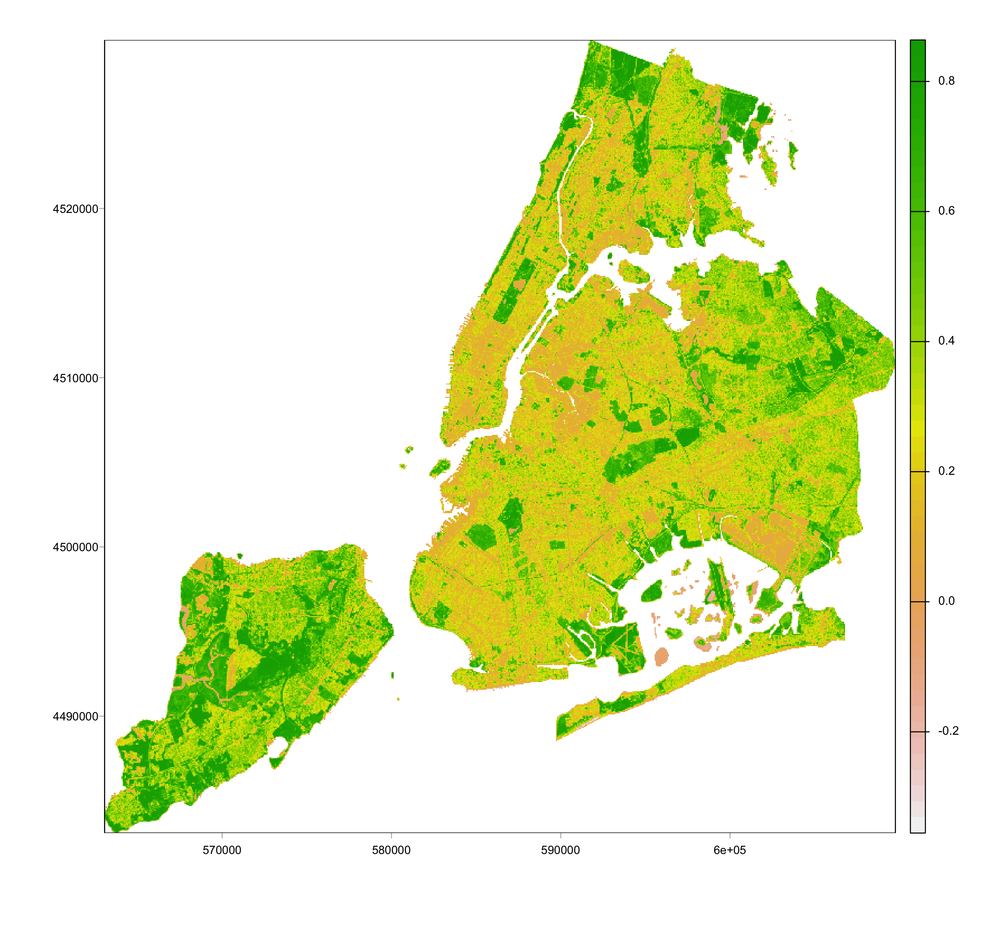
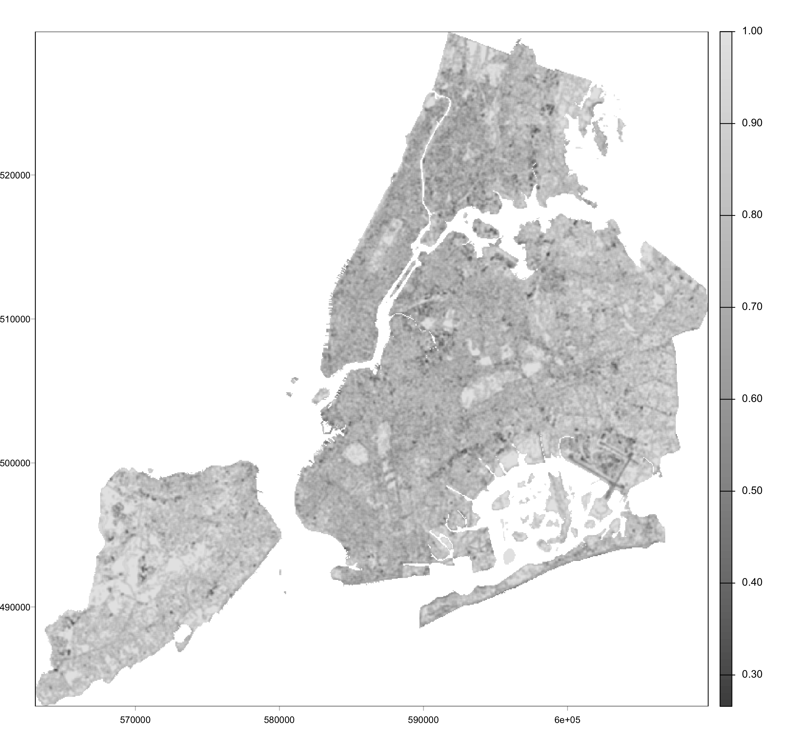

# 3.1 Summary

## 3.1.1 Benefits of understanding the Correction Process

1.  Research in the temporal dimension When comparing maps from different time periods, especially older datasets that do not have ARD versions, we may need to manually select ground control points and run linear regression to perform geometric correction. Understanding this process helps ensure that historical data can still be aligned and compared with newer datasets.

2.  Selecting appropriate data When choosing datasets from official platforms, it is important to know what kinds of processing procedures the products have already undergone. This understanding helps us select data that is suitable for our research questions.

3.  Transparency of data sources In academic research and reports, maintaining transparency about data sources is very important. Having a clear understanding of the correction process allows us to describe our data sources and preprocessing steps more clearly in our writing.

## 3.1.2 Correction precautions

### 3.1.2.1 Avoid excessive correction

During the correction process, we should not blindly stack different methods together. Applying too many unnecessary corrections may damage the original characteristics of the data.

### 3.1.2.2 My understanding of the workflow

The order I organized here is slightly different from the order presented in class, but this is the workflow that makes the most sense to me:

::: text-center
**Raw data (DN values) -\> Radiometric calibration (DN -\> Radiance) → Geometric correction -\> Atmospheric correction (Radiance -\> TOA Reflectance / Surface Reflectance) -\> Orthorectification + Terrain correction**
:::

### 3.1.2.3 Changes in data types

| Data Level | Description & Definition | Key Correction / Factors Removed |
|:---|:---|:---|
| **(1) DN** | The original digital number recorded by the sensor. | Raw data; no corrections applied. |
| **(2) Radiance** | Energy with physical units (W/m²/sr/μm). | Sensor gain and bias. |
| **(3) TOA** | Top-of-Atmosphere Reflectance. | Sensor hardware noise, solar intensity, angle, and distance. |
| **(4) BOA / SR** | Bottom-of-Atmosphere / Surface Reflectance. | Atmospheric path radiance, scattering, and absorption. |

> **Notes on Data Quality:**

> 1. **Sensors:** Even after converting DN to Radiance, spectral characteristics may still vary between different sensors.

> 2. **Geometry:** Because real observations are affected by terrain shadows and viewing geometry, the output is sometimes "apparent reflectance" rather than true intrinsic reflectance.

 **Table 1: Workflow of remote sensing data preprocessing levels** 

## 3.1.2.4 Comparison of Remote Sensing Pre-processing Corrections

| Dimension | Geometric Correction | Atmospheric Correction | Orthorectification | Topographic Correction |
|:---|:---|:---|:---|:---|
| **Function** | Fixes planar distortions (stretching, shifting). | Eliminates atmospheric effects (scattering, absorption). | Fixes pixel displacement caused by terrain elevation. | Eliminates illuminated geometry differences (sunlit vs. shaded). |
| **Main Process** | GCP selection $\rightarrow$ Modeling $\rightarrow$ Resampling. | Parameter estimation $\rightarrow$ Radiative Transfer Modeling (e.g., 6S). | Integration of **DEM** $\rightarrow$ Displacement calculation $\rightarrow$ Repositioning. | Calculation of incidence angle via DEM $\rightarrow$ Physical/Empirical modeling. |
| **Data Change** | Changes pixel coordinates; spectral values may slightly vary. | **Fundamental change** in values (from radiance to physical reflectance). | Significant boost in spatial accuracy, especially in mountainous areas. | Enhances brightness in shadows; reduces over-saturation on sunny slopes. |
| **Limitations** | Cannot handle displacements caused by terrain relief. | Highly dependent on the accuracy of real-time atmospheric metadata. | Extremely sensitive to the resolution and quality of the input DEM. | May introduce noise/over-correction in deep shadow (no-light) areas. |

 **Table 2: Comparison of Remote Sensing Pre-processing Corrections** 

### 3.1.2.5 Order of corrections

It is important that atmospheric correction should be performed before terrain correction. Otherwise, atmospheric noise may be mistakenly treated as part of the ground signal and included in the terrain correction calculation, which can lead to systematic errors in the correction coefficients. When brightening shaded slopes. If atmospheric noise is amplified during this process, shaded areas may become excessively bright.

# 3.2 Application
For this week's application, I took New York City as an example and selected Landsat 9 data from August 22, 2025 as the analysis object.

## 3.2.1 NDVI
After obtaining remote sensing data, we often apply enhancement techniques to make certain features more visible. Ratio-based methods are one common approach, as they can highlight differences between spectral bands and improve the overall image contrast. A typical example is the Normalized Difference Vegetation Index (NDVI). Since vegetation reflects red and near-infrared light differently under different conditions, we can use this property and the corresponding formula to distinguish vegetation with different characteristics.

$$
NDVI = \frac{NIR - Red}{NIR + Red}
$$

After generating the NDVI map of New York in the summer of 2025, we can clearly identify the spatial distribution of vegetation across the city. In particular, Central Park in the city center appears as a strong green area, which shows that this method effectively enhances vegetation features. 

{width="80%" fig-align="center"}

## 3.2.2 Texture
Texture analysis uses Landsat remote sensing data to describe surface characteristics, such as distinguishing between smooth and rough areas. It helps identify different land cover types, including forests, grasslands, and built-up areas. One advantage of this method is that it provides an additional feature dimension, and it is also sensitive to edges, which helps produce more detailed spatial boundaries. However, this method also has some limitations. For example, the moving window approach cannot calculate values at the image edges due to a lack of neighboring pixels, which leads to information loss in those areas. In addition, parameter tuning and computation require more time.

In the next step, I combined the red band with the texture data to create a new composite image. In this image, purple areas generally indicate higher vegetation activity, which can be seen in urban parks, lawns, and golf courses. Some dark blue areas represent higher surface roughness, mainly located in the southeastern part of the city, such as airports and ports. Dark green areas indicate regions with little vegetation and uneven surfaces, which can be interpreted as high-density built-up areas.

::: {layout="[[50, 50]]" layout-valign="bottom"}

:::

## 3.2.3 PCA
PCA is mainly used for dimensionality reduction. It transforms multiple correlated variables into a smaller number of key components. In this way, PCA helps reduce redundancy, extract important features, and simplify computation.

We can apply PCA when a dataset contains many variables and there are strong correlations between them. However, PCA also has some clear limitations. For example, the transformed components are often difficult to interpret, and some information loss is unavoidable during the dimensionality reduction process. 

In this case, I combined the first three principal components (PC1, PC2, and PC3) into a single image. Their proportions of variance are 0.535, 0.3342, and 0.1308, respectively, which indicate how much of the original data variance each component explains. It is important to note that these components are uncorrelated with each other. Together, they present the spatial structure of New York in a more compact and high-contrast way.

{width="80%" fig-align="center"}

# 3.3 Reflection

Regarding the correction section, I spent quite some time trying to understand the overall order of the remote sensing data processing workflow. I also struggled for a while with some of the detailed concepts in different correction methods. For example, it took me some time to fully accept and understand why backward mapping is generally considered better than forward mapping.

During my undergraduate studies, I took a meteorology course that briefly introduced some concepts related to radiation. However, this course builds on that foundation and involves many more scientific processing methods and procedures. Because of this, I needed to spend more time trying to understand these concepts in detail.

Fortunately, the time spent on this was worthwhile. Through this process, I gradually developed a general understanding of how remote sensing data are processed and corrected.
