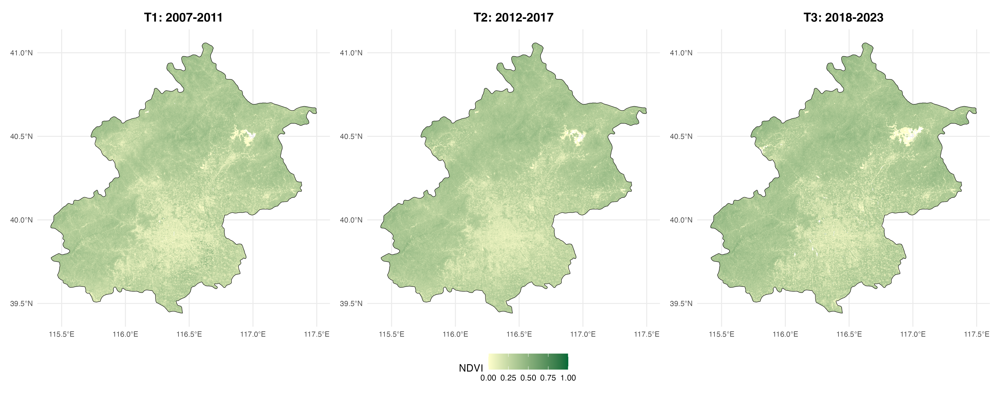
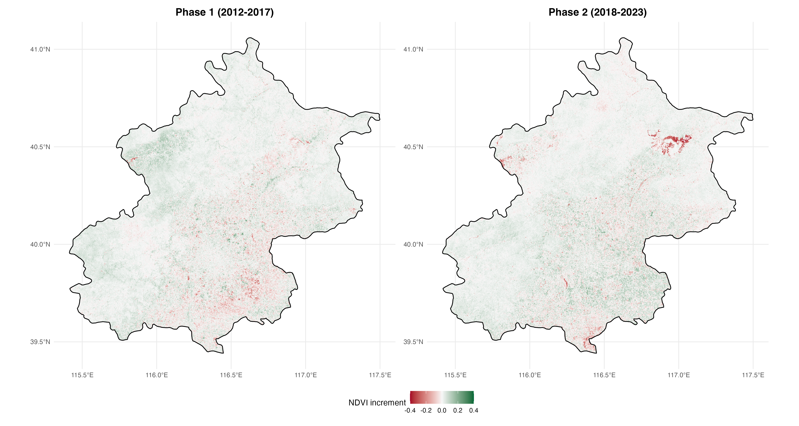
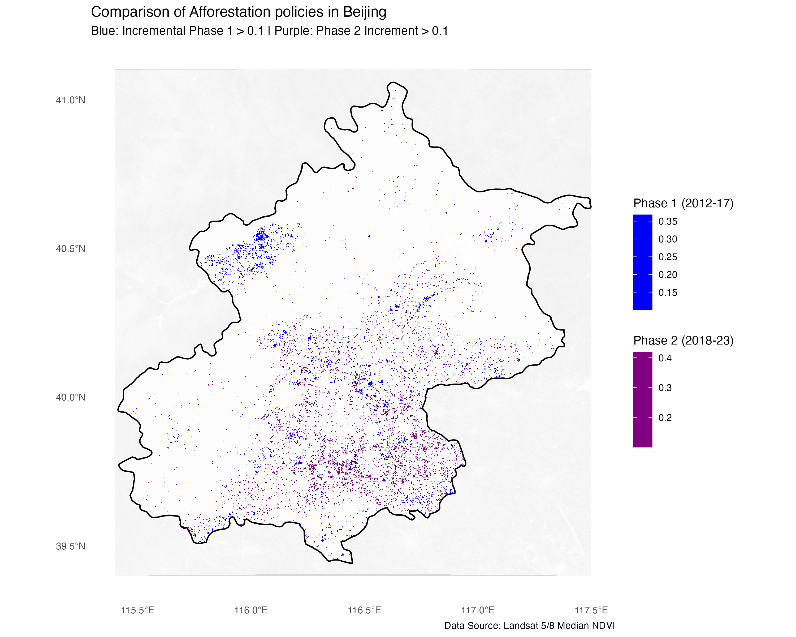

# 4.1 Summary

## 4.1.1 Example: Beijing's Tree Planting Policy

In the fourth week of the lecture, we learned how remote sensing data can be applied in policy making. For example, NDVI values can be used to observe the spatial distribution of urban green spaces, which can further support research on the accessibility of these green areas and their impacts on residents’ physical and mental health. Remote sensing data can also be used to analyse the spatial distribution of urban heat and to explore the relationship between the Urban Heat Island (UHI) effect and environmental justice.

The requirement for this week’s learning diary is: Identify and evaluate a policy case related to remote sensing data and connect it to a global policy framework.

In this part, I focus on Beijing’s two large-scale afforestation programmes in 2012 and 2018, which together involved the planting of more than one million mu of forest. I will also examine two key policy documents: 《北京市人民政府关于2012年实施平原地区20万亩造林工程的意见》(Beijing Municipal Government Notice on Implementing the 200,000-mu Afforestation Project in the Plain Area, 2012 [@beijing2012afforestation]) and 《北京城市总体规划 (2016–2035)》 (Beijing Master Plan 2016–2035 [@beijing2017masterplan]).

In addition to long-term national development strategies, two major environmental events also revealed the ecological pressure faced by Beijing: the PM2.5 air pollution crisis in 2011 and the “7.21” extreme rainstorm in 2012. These events exposed the risks associated with rapid urban expansion and environmental degradation, and prompted the government to accelerate the construction of a greener urban environment in Beijing.

## 4.1.2 Content of Beijing Afforestation Policies

| Policy Document | Core Objectives & Spatial Strategy |
|:---|:---|
| **Beijing Afforestation Project, 2012** | (1) Accelerate afforestation and greening in the plain areas and develop an urban forest system.  (2) Establish a green spatial pattern described as “two rings, three belts, nine wedges, and multiple corridors.”  (3) Implement new afforestation projects to develop landscape ecological forests and green corridors. |
| **Beijing Master Plan 2016–2035** | (1) Establish a municipal ecological spatial structure of “one ecological barrier, three ring corridors, five rivers, and nine green wedges.”  (2) Promote the development of a forest city.  (3) Develop a recreational green space system composed of interconnected parks and greenways, and optimise the spatial distribution of green spaces. |

# 4.2 Application

## 4.2.1 The mutual influence between remote sensing data and policies

Since the effects of large-scale afforestation are unlikely to be visible immediately after implementation, I decided to conduct a simple analysis of the changes in forest and green space coverage in Beijing following these two policies. To do this, I compare the median summer NDVI values across three different time periods in order to observe potential increases in vegetation coverage. The three periods selected for comparison are 2006–2011, 2012–2017, and 2018–2023.

{width="90%" fig-align="center"}

Through remote sensing data, we found that the areas with high NDVI values in the southeastern plain of Beijing have an increasing trend.

{width="90%" fig-align="center"}

::: {layout="[[30, 70]]" layout-valign="bottom"}
![Figure3. Urban Green Space Structure Planning Map(Source: [@beijingGreenSpaceMap])](images/4_BJ_Urban Green Space Structure Planning Map.jpg)

:::

The spatial strategy differences between the two rounds of afforestation policies are obvious and we can observe how remote sensing data and policy interventions interact with each other. Combining the planning map (Figure3) and the actual NDVI difference map (Figure4), we found that the planning and implementation are basically consistent. Overall, the NDVI maps suggest that vegetation coverage has gradually increased across the three time periods. This indicates that the afforestation policies may have had a positive impact on the expansion of green spaces in Beijing.

Looking more closely at the spatial patterns, the results of the first round of afforestation show that most of the increase in vegetation occurred in the outer areas of the city, especially in the mountainous areas in the northeast. This suggests that the government may have relied on remote sensing analysis to identify available land resources, such as vacant land or reclaimed spaces, which were then selected as suitable sites for the initial afforestation programme.

However, the spatial pattern of the second round of afforestation appears somewhat different. It is possible that, after evaluating the results of the first phase—potentially using remote sensing data and related analytical methods—the authorities realised that large forest areas located in distant suburban regions had limited influence on improving the urban microclimate within the city center. As a result, The second round of afforestation is mainly concentrated in the plain areas of cities. This spatial shift is empirically supported by @Yao2026, who argued that while the first phase significantly expanded the green baseline, the second phase (2018-2022) focused more on optimizing the structure of Public Green Spaces (PGS) to enhance urban microclimates and accessibility.

Based on this observation, a possible policy–data interaction process can be inferred:

::: text-center
**long-term planning needs and the occurrence of environmental crises → identification of potential land parcels through remote sensing analysis → introduction of relevant policies → implementation of the first round of large-scale afforestation → evaluation of policy outcomes using remote sensing data → policy adjustment and refinement → implementation of the second round of afforestation.**
:::

This process illustrates how remote sensing data can support evidence-based urban environmental governance, not only in identifying suitable locations for ecological interventions but also in evaluating policy outcomes and informing subsequent planning decisions.

## 4.2.2 Relationship with the United Nations SDGs

| United Nations SDG Goals | Keywords of Beijing Afforestation Policy |
|:-----------------------------------|:-----------------------------------|
| **SDG 11** (Cities) | One ecological barrier, three ring corridors, five rivers, and nine wedge-shaped green spaces |
| **SDG 13** (Climate) | Ventilation corridor system, improve carbon sequestration |
| **SDG 15** (Life) | Protecting and restoring biodiversity, near-natural forestry |
| **SDG 3** (Health) | Improve air quality, improve the quality of the ecological environment |

Source: [@un_sdgs]

## 4.2.3 Limitation

1.  Biophysical limitations of NDVI and the simplification of ecological indicators

When analysing remote sensing data, it is important to recognise that NDVI only reflects the “greenness” of vegetation or its spectral reflectance characteristics, and cannot directly represent the structure and function of an ecosystem. In other words, NDVI can indicate where vegetation coverage has increased, but it cannot fully demonstrate the quality of vegetation or its ecological impacts. Therefore, in related analyses it is necessary to combine NDVI with other datasets in order to obtain a more comprehensive understanding. For example, it can be integrated with air quality data (such as PM2.5) or climate-related indicators such as land surface temperature (LST).

2.  Limitations of spatial resolution

In this analysis, I only used Landsat data available on the GEE platform, which has a spatial resolution of 30 m × 30 m. While this resolution is sufficient for a general overview, it may not be adequate for more rigorous academic research or for supporting detailed policy-making processes. In such cases, higher-resolution commercial satellite imagery would be more appropriate, especially when analysing fragmented green spaces within urban areas, such as pocket parks or roadside green belts.

3.  Relationship with social functions

Remote sensing data can detect the physical distribution of vegetation within the study area, but it cannot directly demonstrate the social functions of these green spaces. For example, although vegetation coverage may increase, this does not necessarily mean that residents have better accessibility to green spaces. To evaluate such social dimensions, additional analytical tools are required. For instance, tools such as R5R can be used to further analyse the accessibility of green spaces through transport networks.

# 4.3 Reflection

Beyond the technical limitations of indices and resolution, the core value of this case study lies in the governance logic. After examining the case of the two rounds of afforestation programmes in Beijing, and drawing on the study by @Yao2026, I realised that in both academic research and the process of policy formulation and implementation, it is particularly important to establish a closed loop of evidence-based decision-making. In this context, remote sensing should not only serve as a tool for post-hoc evaluation, but also as a means of dynamic policy adjustment.

The spatial shift of afforestation sites between 2012 and 2018 can essentially be understood as a form of policy iteration based on observational evidence. In other words, the observed outcomes from earlier interventions may have informed subsequent adjustments in planning strategies.

At the same time, remote sensing analysis should also be combined with social equity indicators, in order to ensure that the benefits of urban greening are distributed more equitably among all citizens.