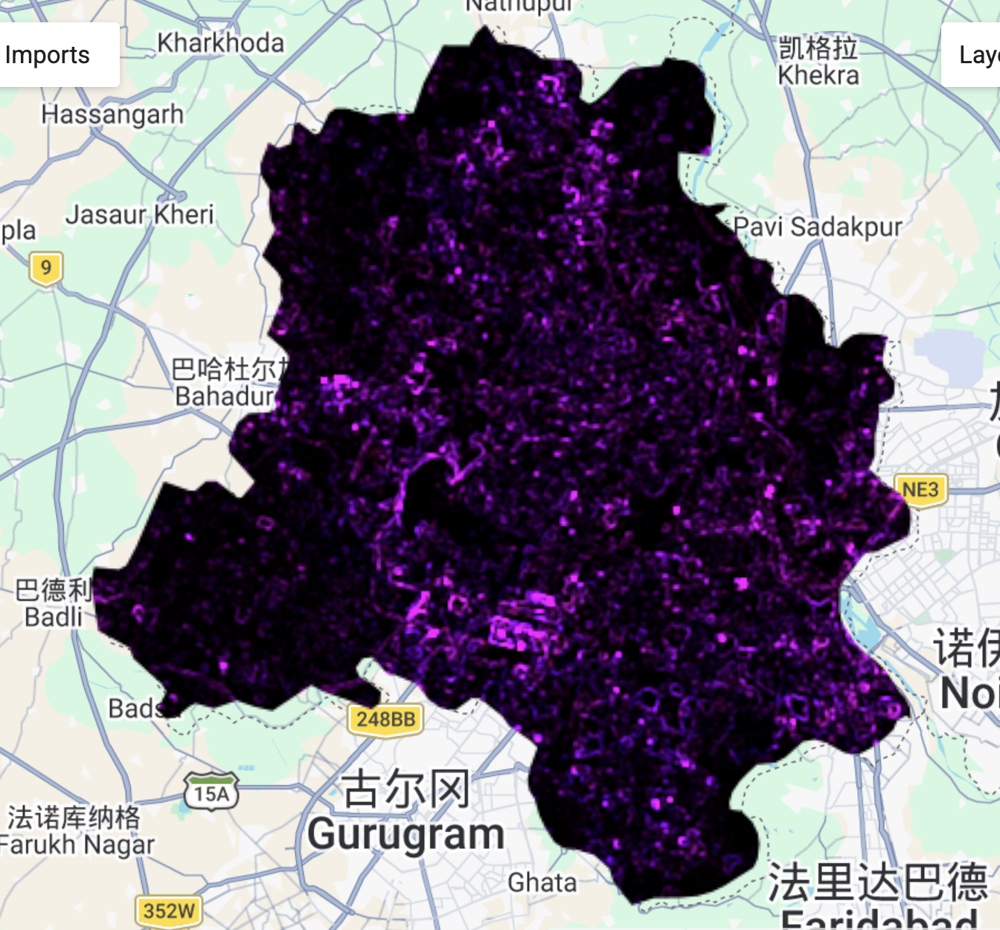
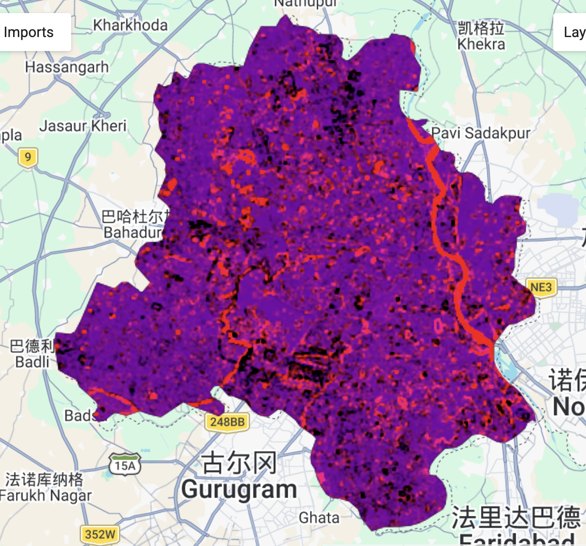

\*Weekly summaries, applications, and reflections, not just a list of knowledge points.

# 5.1 Summary

## 5.1.1 Google Earth Engine Introduction
This week, we learned about Google Earth Engine (GEE). It provides a unified data platform that integrates open remote sensing datasets from space agencies around the world, and we can access and process these data flexibly using code. In addition, GEE offers a powerful cloud computing environment, which allows us to run large-scale geospatial analysis without relying on local hardware or downloading data. As a result, it greatly improves efficiency when working with large datasets and wide spatial areas.

![Figure1. GEE screen: [@gee_cookbook_screen]](images/6_ee-editor_1920.png){width="90%" fig-align="center"}

## 5.1.2 GEE jargon Summary

| Term | Category | Definition & Characteristics |
| :--- | :--- | :--- |
| **Image** | Raster | A fundamental data object representing a single georeferenced image, composed of one or more bands (e.g., RGB, NIR) |
| **Feature** | Vector | A data structure comprising a Geometry (spatial shape) and a dictionary of Properties (metadata/attributes) |
| **ImageCollection** | Collection | A stack or sequence of multiple Images, typically organized by time or sensor type |
| **FeatureCollection** | Collection | A group of related Features, analogous to a spatial database table or a Shapefile |
| **Client-side** | Environment | The user's local browser environment (JavaScript), responsible for managing the interface and issuing instructions |
| **Server-side** | Environment | Google's cloud computing infrastructure where heavy processing occurs; objects are prefixed with `ee.` |

**Table 1: GEE jargon Summary**

When using GEE, we also need to pay attention to several important points.

(1) **Looping**: GEE separates client-side and server-side operations. A traditional for loop cannot directly work on an ImageCollection on the server side, because we cannot access each element in the collection in the same way. If we use a standard loop, it may lead to repeated computations or unnecessary data loading. Therefore, we should use the server-side .map() function instead.

(2) **Scale**: Although the original datasets have their own spatial resolution. For instance, Sentinel-2 has 10m resolution and Landsat 8/9 has 30m resolution. GEE often performs calculations based on the current zoom level.Taking 10m dataset as an example, when we zoom in, it may interpolate the data to a finer resolution, while zooming out may result in coarser calculations. Therefore, it is important to explicitly set the output scale when performing analysis.

Finally, I personally find the pre-processed datasets in GEE very useful. They make it much easier to find relevant data for further study and can save a significant amount of time.

## 5.1.3 Reduce

In the next part, we also learned the usage of reduce related functions, as shown in the table below. In fact, from top to bottom, it corresponds to the content of taking mean/median values, texture analysis, and PCA.

| Dimension | Function Interface | Key Features | Typical Use Cases |
| :--- | :--- | :--- | :--- |
| **Temporal** | `collection.reduce()` | **"Flattens" a collection** by synthesizing a time-series of images into a single cloud-free base map | Monthly/Annual NDVI synthesis, cloud removal |
| **Spatial** | `image.reduceRegion()` | **"Image to Value"**. Extracts statistical metrics within a specific geographic boundary (ROI) | Mean temperature of a city, total crop area statistics |
| **Neighborhood** | `image.reduceNeighborhood()` | **"Feature Extraction"**. Generates new features based on spatial relationships within a sliding window | Edge detection, terrain roughness (StdDev), smoothing |

**Table 2: Reduce classification**

## 5.1.4 Advantages and limitaions

| Dimension | Advantages | Limitations |
| :--- | :--- | :--- |
| **Data Accessibility** | **Massive Cloud Archive**: Instant access to petabytes of global remote sensing data without local downloads | **Data Black Box**: Difficult to manipulate raw underlying files; slow upload process for non-native user assets |
| **Computation Performance** | **Parallel Processing**: Leverages Google's server clusters via `.map()` for high-speed analysis of large datasets | **Resource Constraints**: Shared computing resources; complex scripts may trigger "Memory Limit Exceeded" or timeouts |
| **Spatial Analysis** | **Multi-scale Dynamic Zooming**: Automatically handles different resolutions and supports analysis from local to global scales | **Scale Trap**: Results depend on the `scale` parameter; failure to specify it manually can lead to significant precision errors |
| **Development Environment** | **Instant Visualization**: Real-time rendering of code results on the map, facilitating rapid algorithm prototyping | **Debugging Challenges**: Since code runs on the server, error messages can be cryptic and hard to trace to specific logic |

**Table 3: Advantages and Limitaions of GEE**

# 5.2 Application

## 5.2.1 Research area: Delhi

In this lecture, we explored the data of Delhi, India from June 2021 to October 2022 based on practical content, mainly calculating the texture map of Delhi and then conducting PCA analysis. The entire process was much faster than before in QGIS.

### 5.2.1.1 Mean and Median
When we need to combine multiple raster datasets, the mosaic operation is mainly useful for quick visualization. However, when we conduct more detailed analysis, we need to consider the differences between using the mean and the median.

The mean method works well for smaller datasets. It produces smoother results and helps reduce boundary effects. However, it is highly sensitive to outliers, and the results do not represent actual observations but rather statistical values.

In contrast, the median method is more suitable for larger datasets and performs better in reducing cloud effects. However, the final image may include data from different time periods. Although these are real observations, they are not captured at the same time, and extreme values may become less noticeable.
If higher accuracy is required, we can also apply histogram matching to process the images. This method improves the consistency of the image and is suitable for more advanced analysis, although it is more complex to implement.

### 5.2.1.2 Texture measure

In this texture map, we used the GLCM method to extract and display the spatial contrast of Delhi. We can see that the image is mainly dark, with some bright purple spots distributed across it. These bright purple areas indicate higher texture values, which usually correspond to regions with strong spatial variation, such as residential areas and road networks.
In contrast, the dark areas represent low texture values. These areas are more homogeneous and show smoother surface patterns, and they are mainly associated with water bodies, parks, and agricultural land.

{width="80%" fig-align="center"}

### 5.2.1.3 PCA
This PCA map of Delhi combines PC1 and PC2 and mainly highlights areas with high reflectance, such as buildings, industrial zones, and bare soil. On the right side of the city, we can see a clear red strip, which corresponds to the floodplain and riverbank area of the Yamuna River. Since sandy surfaces have similar spectral reflectance to urban buildings, they are also emphasized in the image.

Compared with the texture map, this river-related area is not very visible. This is because sandy surfaces are relatively flat and do not show strong pixel variation. As a result, the GLCM method identifies these areas as smooth, so they do not stand out in the texture map.

{width="80%" fig-align="center"}

Overall, these two methods have different strengths and limitations. PCA may confuse land covers that have similar spectral properties but different structures, while texture analysis may confuse features that have different spectral characteristics but similar structures. Therefore, PCA is more suitable for analyzing material differences and performing land cover classification, while texture analysis is more useful for identifying structural differences, extracting urban boundaries, and detecting impervious surfaces.

## 5.2.2 GEE Application

GEE has a wide range of applications, including urban studies, agriculture, vegetation analysis, and natural disaster monitoring, as shown in the figure below.

![Figure4. GEE Application [@GEE_application]](images/6_GEE_1.png){width="80%" fig-align="center"}

The next figure clearly illustrates the internal workflow of GEE. It shows how data start from single images or ImageCollections, go through different processing steps and algorithms (e.g.: Machine learning, Supervised and unsupervised classification...), and finally produce visualized results.

![Figure5. GEE Workflow [@GEE_application]](images/6_GEE_2.png){width="80%" fig-align="center"}

# 5.3 Reflection

After learning the basics of GEE in this session, I found that this platform is very efficient for handling large-scale and long-term geospatial data. During my past studies, I worked on a small project that explored the urban heat island effect in my hometown, Taiyuan, for a specific year. At that time, I downloaded Landsat 8/9 data and processed them in GIS by grouping the data by month or season. Then, I combined the required bands into images and applied median compositing. Overall, the process was quite time-consuming.I originally planned to extend this work to analyze changes in the urban heat island effect over multiple years, but I had to give up due to time limitations. 

After this session, I realized that I can use code to process these data much more efficiently. By the way, during my initial use of GEE, I noticed that every time I add new code, I need to run the entire script again. This increases the workload and can be quite stressful, especially when the code becomes large. In my case, the interface crashed twice during this exercise. Therefore, I hope that future sessions will include some guidance on how to optimize GEE code and improve efficiency.This greatly improves the workflow. I look forward to learning more about how to use GEE to process and analyze data more efficiently in future classes.
