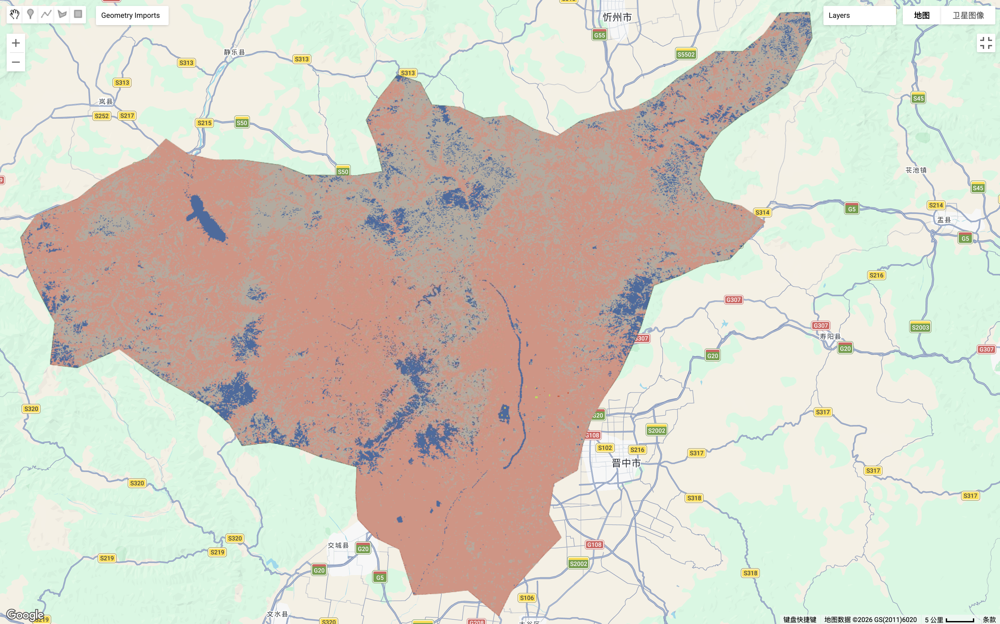

# 6.1 Summary

## 6.1.1 CART

Following the introductory session on GEE in the last class, this week we learned about machine learning in GEE, which helped us better connect different parts of the course.

In the first part of the lecture, we were introduced to the basic concepts of machine learning. We first learned about decision trees as a general method. They are similar to flowcharts, where decisions are made through a series of yes-or-no questions. CART (Classification and Regression Trees) is a classic type of decision tree algorithm, which can be divided into classification trees and regression trees. In addition, a random forest consists of multiple decision trees, and all trees must be of the same type, either classification or regression, rather than a mixture of both.

Because I didn't understand the relationship between these trees at the beginning, although this part of the knowledge is relatively basic, I still put a table here specifically to show it.

### Comparison of Machine Learning Models in Remote Sensing

| Feature | Classification Tree | Regression Tree | Random Forest |
|:---|:---|:---|:---|
| **Core Function** | Divides data into discrete **categories** | Predicts continuous **numerical values** | Enhances **accuracy and stability** via ensemble learning |
| **Output** | Class labels (e.g., Forest, Urban, Water) | Specific numbers (e.g., Temperature, Price, Biomass) | Majority vote (Classification) or Average value (Regression) |
| **Measurement Criteria** | Gini Impurity | Mean Squared Error (MSE) | OOB Error |
| **Advantages** | Easy to visualize; logical "flowchart" structure | Handles non-linear relationships; captures numerical trends | Highly robust; prevents overfitting; handles high-dimensional data |
| **Limitations** | Prone to overfitting; sensitive to small data changes | Struggles with extreme values or sharp data "jumps" | "Black box" model; difficult to interpret individual logic |
| **Application** | **Land Cover**: Distinguishing Central Park (Greenery) from Skyscrapers (Urban) | **Retrieval**: Estimating Leaf Area Index (LAI) or Soil Moisture from band data | **Complex Mapping**: Combining NDVI, PCA, and Texture to map city-wide land types |

**Table 1: Comparison of Machine Learning Models in Remote Sensing**

In this process, I think one of the most important issues is overfitting. When we train a machine learning model, we want it to capture the main patterns in the data, but at the same time we don’t want the model to “learn too rigidly”. In other words, it should not fit every single sample too perfectly. Although this may give very good results on the training data, it actually reduces the model’s ability to generalize and makes it hard to apply to new data.

So when overfitting happens, we need to control the growth of the decision tree, for example by limiting its depth or pruning some less important branches, so that the model becomes simpler and more robust. 

## 6.1.2 Unsupervised and Supervised

### Comparison of Supervised and Unsupervised Learning in Remote Sensing

| Dimension | Supervised Learning | Unsupervised Learning |
|:---|:---|:---|
| **Definition** |Uses known training samples to build a model, then classifies unknown pixels | Automatically clusters pixels based on spectral similarity without prior knowledge |
| **Core Features** | Requires manual selection of Training Sites;   Classes are defined before classification | Algorithm finds natural groupings;   Clusters are identified first, then manually labeled after |
| **Advantages** | **High Accuracy**: Customizable to specific research goals; Results directly correspond to real land cover | **High Automation**: No time-consuming sampling; **Discovery**: Can identify subtle spectral differences humans might miss |
| **Disadvantages** | **Labor Intensive**: Manual sampling is slow and subjective;   **Sample Dependent**: Errors in training lead to map-wide errors | **Hard to Control**: Clusters may not match real-world logic (e.g., shadows mixed with water);    **Post-processing**: Heavy manual labeling required |
| **Common Algorithms** | Maximum Likelihood (MLC),   Random Forest (RF),   Support Vector Machine (SVM),   Neural Networks | K-means,   ISODATA,   DBSCAN |
| **Applications** | **Precise Land Use Mapping**: Distinguishing Urban vs. Residential; Change Detection | **Exploratory Analysis**: Large-scale surveys; areas where ground truth/reference data is unavailable |

**Table 2: Comparison of Supervised and Unsupervised Learning in Remote Sensing**

## 6.1.3 Two main methods

## 6.1.3.1 How to choose an appropriate method

At this stage, we learned that supervised learning methods can generally be divided into parametric (assuming the data follow a normal distribution) and non-parametric approaches (do not need follow a normal distribution). A typical example of the former is the Maximum Likelihood method, while the latter includes commonly used models such as Support Vector Machines (SVM) and neural networks.
I found this part quite confusing at first because there are so many different methods, but the diagram below helped me develop a better understanding how to choose an appropriate method in different situations.

![Figure 1.Supervised classification algorithm selection [@Supervised]](images/7_supervised-classification-algorithm-selection-en.png){#fig-algorithm width="80%" fig-align="center"}

## 6.1.3.2 Maximum likelihood & SVM

| Feature | Maximum likelihood | Support Vector Machine (SVM) |
|:---|:---|:---|
| **Definition** | Using probability theory, assign pixels to the maximum probability terrain type displayed in the histogram | Find the Maximum Margin hyperplane that can separate training data of different categories |
| **Advantage** | The effect is excellent when the samples follow a normal distribution and are not correlated with each other | Strong generalization ability: can reduce errors in unseen data;   Capable of handling small samples and high-dimensional complex data |
| **Limitation** | If the spectral distribution of land cover is not normal, the accuracy will be very poor | Multiple adjustments of hyperparameters are required for testing during model training, resulting in increased computational costs |
| **Application** | Traditional land cover classification;   A region with simple and evenly distributed spectral features | Complex urban form detection;   Multi source data fusion classification (e.g.: band+texture+terrain) |

**Table 3: Comparison of Maximum likelihood & SVM**

# 6.2 Application

## 6.2.1 Practical

In this practical, I moved my study area from Shenzhen to my hometown, Taiyuan, which is a typical industrial city in northern China. I also chose to focus on bands B2, B3, B4, B8, B11, and B12. This is because, compared to vegetation-rich Shenzhen, Taiyuan has a lot of loess hills and bare land, so this band combination works better for distinguishing built-up areas, grassland, and vegetation.

::: {layout-ncol="2"}

:::

Then, I applied the classification approach that I had adjusted in the practical to Taiyuan. The CART result was still reasonably clear, but I found that the object-based random forest performed much worse than it did in Shenzhen. One issue was that the already limited sample size became even smaller after splitting, which caused the model to degrade. At this stage, the model clearly lost its ability to make good predictions. The result looked much more blurred than before, and was even worse than the CART output.

::: {layout-ncol="2"}

:::

Later, I switched to pixel-based random sampling. This allowed the model to access more pixel-level information within each polygon and improved the training process. As a result, the final model achieved an accuracy of 92% in GEE. 

## 6.2.2 Flood monitoring

SVM is not only used for urban land use classification, but can also be applied to more complex surface conditions. For example, Ahmed M. Youssef and his colleagues [@sharma2023comparative] used SVM to map flood susceptibility in the catchment area of Taif, Saudi Arabia. They divided the study area into five classes: very low, low, moderate, high, and very high, which can provide useful guidance for future urban development. In their study, they included 13 influencing factors and compared SVM with a bivariate model (FR) and a multivariate model (LR). The results show that SVM performs better in handling multiple variables and nonlinear relationships.

However, I think this approach still has some limitations. Although the study uses multi-year remote sensing data, the model essentially works at the pixel level and only predicts the probability of flooding at each location. It does not consider the interactions between neighboring pixels, so it cannot fully capture how floods spread continuously in space. In other words, spatial autocorrelation is not taken into account. In this case, methods such as Convolutional Neural Network could be introduced, since convolutional kernels can incorporate information from surrounding pixels and help better represent spatial structures.

::: {layout-ncol="2"}

![Figure 6.Multiple methods for analysis and comparison [@sharma2023comparative]](images/7_flood.png)

![Figure 7.Supervised classification algorithm selection [@sharma2023comparative]](images/7_flood_1.png)

:::

# 6.3 Reflection

In this session, we finally started working on remote sensing combined with machine learning for classification. However, while learning how to use these tools, I found myself going back to the reflection I had in the first week. Maybe because my undergraduate background is not in planning, I tend to pay more attention to details than some planning students (even though these details are not always that important).

After this class, I feel that the current land classification methods we learned are still quite coarse. As someone who has done fieldwork and recorded vegetation structures in landscape studies, I have always hoped that there could be an open and free method to reduce the burden of manual data collection. For example, if we could apply GEE to classify landscape function and quality, and further break down urban green spaces into categories like “tree canopy”, “shrubs”, and “grassland”, it would help us better quantify the ecological performance of these spaces.

Ideally, I would like this to go even further, such as identifying specific tree species or plant structure. However, based on the literature I have read, these classification approaches are usually applied to large-scale vegetation. Even I know forcefully distinguishing plant species is certainly feasible, but it requires more refined and diverse data (e.g: LiDAR). So, for small-scale and detailed plant identification, the resolution of free data is still a major limitation, and this is not just a technical issue.

