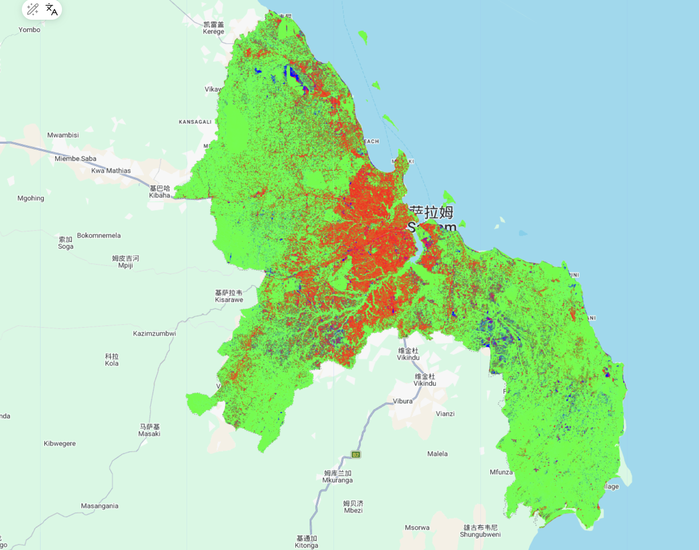
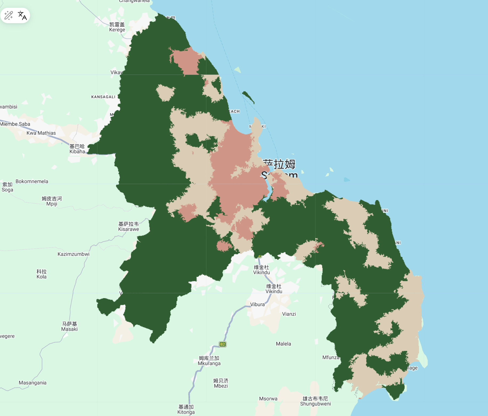
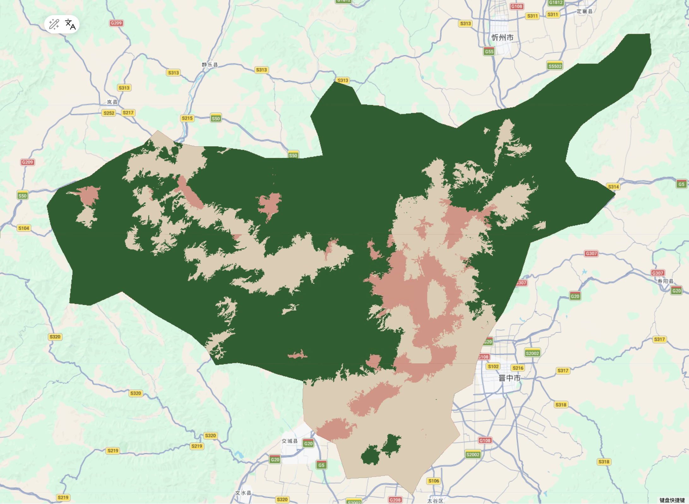

# 7.1 Summary

In this session, we continued working on classification and were introduced to two more advanced methods to address the limitations of traditional pixel-based approaches. We also discussed how to evaluate classification accuracy in a more systematic way.

## 7.1.1 OBIA & Subpixel Analysis

OBIA focuses on turning fragmented pixels into more meaningful and identifiable objects. In contrast, sub-pixel analysis looks at the opposite problem: when a single pixel is too complex, how can we break it down and understand what it contains, for example by estimating the proportion of different land cover types.

### Comparison between OBIA and Sub-pixel Analysis

| Dimension | Object-Based Image Analysis (OBIA) | Sub-pixel Analysis |
|:-----------------------|:-----------------------|:-----------------------|
| **Concept** | Instead of analyzing individual pixels, it groups adjacent pixels with similar spectral, shape, and textural characteristics into "objects" | Assumes a single pixel is a "Mixed Pixel" composed of multiple land cover types (e.g., vegetation, water, soil...) and aims to deconstruct the proportion of each component |
| **Process** | (1) **Split**: Divide remote sensing data pixels into small bricks--Supercells (e.g.:SLIC)   (2) **Classification**: Filtering based on geometric features, spatial relationships, and LiDAR data... | (1) Set pure "Endmembers" as the standard (e.g., 100% water)    (2)Calculate the proportion of different object categories in a grid based on band values (summing to 1) |
| **Application** | (1) High-resolution image classification   (2) Identification of urban buildings and parcel boundaries   (3) Landscape pattern analysis | (1) Medium-to-low resolution imagery (e.g., MODIS, Landsat)   (2) Estimating Vegetation Continuous Fields (VCF)   (3) Precise mapping of wetland or water body edges |
| **Benefits** | (1) Eliminates "salt-and-pepper noise" inherent in pixel-based classification   (2) Reduces data volume and computational overhead (e.g.: merging 10-20 pixels into one object) | (1) Addresses classification bias caused by mixed pixels in low-resolution data   (2) Provides quantitative information finer than the original pixel resolution (e.g.: 70% forest + 30% bare land) |
| **Limitations** | (1) High Subjectivity: Parameter settings (like segmentation scales) rely heavily on researcher experience   (2) Edge processing can be imprecise | (1) Difficulty in Endmember Selection: It is challenging to find 100% "pure" spectral samples in reality   (2) Linear models may fail to capture complex multi-scattering of light on the ground (non-linear issues) |

**Table 1: Comparison of OBIA and Sub-pixel Analysis**

## 7.1.2 Accuracy assessment

We have already explored this part in the CASA0006 Module, and it is important to understand the content in the table below. In fact, when I first started learning this part, I spent a long time sorting out the logical relationship, but after clarifying it, I realized the subtleties of these assessment methods. I have put them all in the table for my future review.

### 7.1.2.1 TP/FP/FN/TN

| | Actual: **Class C** | Actual: **Not Class C** |
|:---:|:---:|:---:|
| **Classified: Class C** | **True positive (TP)**：model predicts positive class correctly | **False positive (FP)**：model predicts positive, but it is negative |
| **Classified: Not Class C** | **False negative (FN)**: model predicts negative, but it is positive | **True negative (TN)**: model predicts negative class correctly |

**Table 2: Accuracy Dimensions**

### 7.1.2.2 Indicator application

In this part, we cannot expect the results to have both high precision and high recall at the same time. They cannot exist simultaneously, but we need to choose based on our needs.

| Metric | Formula | Description | Application | limitations |
|:---|:---:|:---|:---|:---|
| **Precision**(User’s accuracy ) | $\frac{TP}{TP + FP}$ | Measures "purity", vital when you want to avoid over-mapping (false alarms) | **Reduce False Alarms**: E.g.: Precision Strike, High-Value Retail Siting | (1) High false negatives    (2) Insufficient representativeness of the sample |
| **Recall**(Producer’s accuracy) | $\frac{TP}{TP + FN}$ | Measures "completeness", vital when you want to avoid missing target features | **Reduce Missing Targets**: E.g.:Illegal Logging, Fire Response, Cancer Detection | (1) High false noise   (2) Excessive resource investment in handling false positives |
| **OA** (Overall Accuracy) | $\frac{TP + TN}{Total}$ | Measures global reliability, best for balanced datasets | Check the reliability of the entire map | Unbalanced data can lead to model failure |
| **F1-Score** | $2 \times \frac{Precision \times Recall}{Precision + Recall}$ | The harmonic mean, balances the trade-off between Precision and Recall | Check if a specific feature can be accurately identified | Sensitive to categories, easily dividing cities into smaller ones |
| **Kappa** | $\frac{P_o - P_e}{1 - P_e}$ | Adjusts for "chance agreement", crucial for imbalanced land cover classes | Professional evaluation, comparison of different algorithms | (1) Too conservative   (2) The calculation is complex and difficult to explain |

**Table 3: How to utilize**

## 7.1.3 Practical

### 7.1.3.1 Sub-pixel analysis

This week I decided to choose two areas as my research areas--- Daressalaam and Taiyuan. And I discovered something interesting.

After completing the sub-pixel analysis, I noticed clear differences between the two cases. In Daressalaam (the tropical city), the result shows a strong mixture of urban and vegetation, with very little bare land. In contrast, Taiyuan shows a pattern where bare land and green space are more interwoven, forming a valley-based urban structure.
However, in some areas in southern Taiyuan, the image shows purple tones caused by the mixing of red and blue. I think this may be because Taiyuan is located on the Loess Plateau and is a relatively dry northern city with more homogeneous surface types. In this case, the endmembers are quite similar, which makes it harder for sub-pixel analysis to distinguish between built-up areas and bare land, and this affects the unmixing results.

I also noticed some obvious mosaic boundaries in the image. This might be related to the Landsat 8 orbit coverage, and since Taiyuan happens to lie across multiple image tiles, the stitching effect becomes more visible.

::: {layout-ncol="2"}

:::

### 7.1.3.2 OBIA

For the OBIA results, although the segmentation with a seed value of 40 is still a bit coarse, I can already see clear differences. Daressalaam shows a radial urban pattern, where the boundaries between urban and vegetation areas are quite fragmented and mixed. In contrast, Taiyuan presents a more constrained basin structure, with a clearer boundary between the urban area and the surrounding mountains, and more regular object shapes. However, the overall result is still not as good as the random forest result from last week.

This comparison suggests that the performance of OBIA is not only influenced by parameter settings, but also by the underlying urban landscape structure. When terrain provides strong constraints, object boundaries are easier to detect. But when the urban landscape is highly fragmented, these boundaries become much harder to define. 

::: {layout-ncol="2"}

:::

# 7.2 Application

While reflecting on this practical, I realized that the idea of “adapting to local conditions” is actually widely recognised in the literature, and it made me rethink some of my previous assumptions.

At the beginning, I tended to believe in a kind of “accuracy-first” mindset in remote sensing, assuming that higher resolution data and more advanced methods would always lead to better results. However, a study by Vivitskaia J. Tulloch [@Tulloch2017Tradeoffs] on coral reef conservation planning made me reconsider this view. It points out that although high-resolution data can reveal more detailed habitat information, it also increases the risk of misclassification and comes with significant time and financial costs. This made me realise that discussing “accuracy” without considering cost and real-world application is not meaningful. In some cases, a more practical solution that balances cost and local needs can be more valuable than pursuing maximum accuracy.

When it comes to classification methods, the need for flexibility becomes even clearer. A study by Soe W. Myint [@Myint2011Perpixel] in Phoenix supports what I observed in my Taiyuan experiment. In complex urban environments, traditional pixel-based classification often struggles to distinguish between materials like rooftops, asphalt, and bare soil due to similar spectral signatures. His work shows that OBIA can address this issue by incorporating spatial relationships, which is exactly what I started to notice in this week's analysis.

So, these two studies helped me understand that remote sensing is not a fixed set of rules. Whether we are working with a structured and dry city like Taiyuan, a fragmented urban landscape like DaresSalaam, or a complex coral reef system, we need to adapt our methods to the context and carefully consider both cost and practical application.

# 7.3 Reflection

### About Notes and Tables...

To be honest, there was a lot of content this week, and during the review process, I felt that many of the knowledge points were a bit scattered in my understanding. Therefore, I used a lot of tables in this section to help me record what I learned. I actually have a lot more to record about the content after the course, but due to homework requirements, I choose to stop here.

### Interesting attempt

Last week, I was thinking about the issue of coarse classification accuracy, and this week’s lecture directly addressed it by introducing two different approaches: from details to objects (OBIA), and from objects to details (sub-pixel analysis). This really matched what I was interested in.

Because of this, I decided to explore a bit further on my own. I chose two cities with very different climate conditions and urban structures and did a simple comparative analysis. The results helped me understand the course content more deeply, which I found quite exciting.
I know that we often understand some patterns in theory, but going through the process ourselves makes the ideas much more memorable. 

### What exactly is the machine monitoring

This comparison has made me realize one thing: there is no such thing as a 'universal best algorithm,' only the 'most suitable strategy' for a specific local environment. For a northern city like Taiyuan, where urban buildings and bare soil look almost identical, relying solely on spectral data would definitely lead to failure. In this case, spatial structures (OBIA/Gradient) are essential to capturing the urban outlines.

However, in a tropical city like DaresSalaam, where houses and trees are deeply intertwined, fragmented structures actually become noise. For that kind of landscape, using NDVI and spectral unmixing to break down the pixel components is the appropriate method for revealing the truth.
