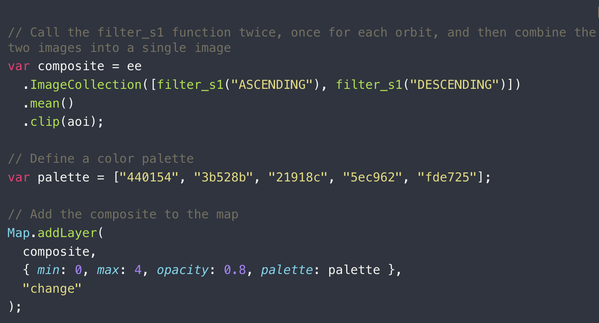
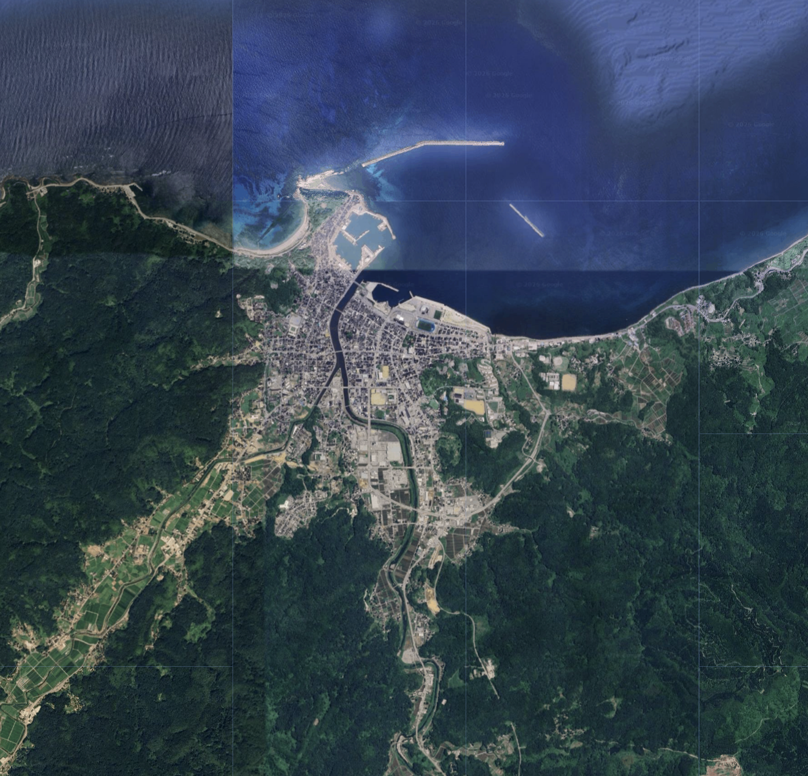
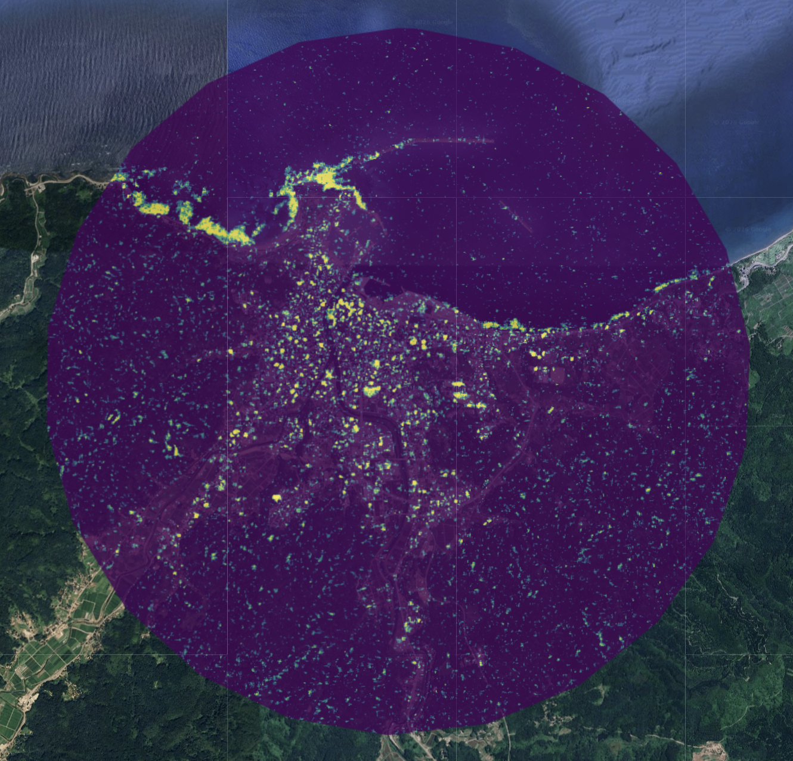
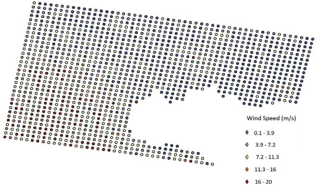
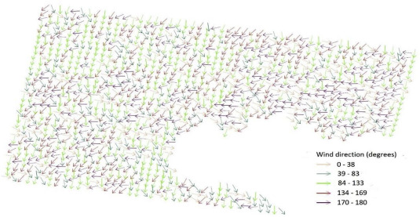
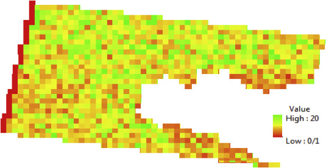

# 9.1 Summary

## 9.1.1 Introduction of SAR

SAR was briefly mentioned in the week 1, but in week 9 we finally had a more detailed introduction to active sensors and their applications. The lecture was also supported by Ollie’s case study on the Beirut explosion, which helped reinforce the concepts.

Unlike the optical remote sensing satellites we learned before, SAR works by sending out electromagnetic waves and analysing the amplitude and phase of the returned signals to monitor changes on the Earth’s surface. The amplitude mainly reflects surface roughness and geometric structure (e.g. calm water appears dark, urban areas tend to be bright). The phase can be used in interferometry (InSAR) to detect very small ground deformations at the centimetre level.

Advantages:

(1) It can operate under almost all weather conditions and is not affected by cloud cover or lighting, making it a good complement to optical data.

(2) It is sensitive to physical properties of objects, which helps identify features such as floods and metal structures.

(3) Microwave signals can penetrate vegetation, allowing us to observe what is underneath.

Limitations:

(1) The images are harder to interpret compared to optical imagery.

(2) Geometric distortions can occur due to side-looking imaging (e.g. layover and shadow), which may cause information loss in some areas

## 9.1.2 Practical

In this Practical, the workflow is based on applying a t-test to Sentinel-1 SAR data to detect abnormal changes in backscatter intensity. Then, by combining the results with building footprint data, these change pixels can be used to further identify damaged buildings, which clearly shows the impact of the explosion in the study area.

A key step in this process is to separate ascending and descending orbit data and then take their average, so that we can achieve more complete coverage of the study area.

However, it is important to note that due to terrain or observation geometry, some areas may only have data from one orbit direction. For example, when I tried to analyse the damage caused by the 2024 Noto Peninsula earthquake in Japan, I found that there was no ascending orbit data available, so I had to rely only on descending data.

{width="90%" fig-align="center"}

According to the distribution of high t-value pixels (bright yellow) in the change detection map, it shows that the most significant destructive changes are concentrated in two core disaster zones: the coastal uplift area northwest of Wajima Port and the collapsed urban building clusters.

In contrast, the yellow pixels in the southwestern and eastern mountainous areas are relatively sparse and scattered. While this may reflect lower actual damage in these regions, it could also point to technical limitations: due to the absence of Ascending orbit data in this analysis, the single Descending pass may have been affected by SAR side-looking geometry. Specifically, the steep terrain could have created radar shadows, diluting or masking the signals of landslides or vegetation disturbances triggered by the earthquake. 

::: {layout-ncol="2"}

:::

# 9.2 Application

## 9.2.1 About UGS

As mentioned in some previous diary entries, I have been thinking for a while about how to better identify the structure of urban green spaces and further evaluate their ecological effects. This week’s introduction to SAR gave me a new perspective on this question, and a review by Amir Reza Shahtahmassebi [@shahtahmassebi2021sar] and colleagues also supports this idea. The paper points out that current research on urban green spaces (UGS) still shows an imbalance in both data and methods. However, SAR has the ability to penetrate vegetation canopies and capture information from beneath them. This gives it unique potential for analysing vegetation structure, moisture conditions, and even biomass.So I think that if SAR can help move urban green space analysis from simple surface-level identification to a more structural and ecological understanding, it could play an important role in more detailed planning and practical policy implementation in the future.

## 9.2.2 About Potential Wind Field Analysis

SAR has a wide range of applications. I used to mainly associate it with flood detection, but when I started thinking about our CASA0025 group project, I looked into some studies on using SAR for offshore wind energy assessment.

SAR can capture sea surface roughness and derive wind field information over large areas, which provides a more complete spatial view of wind resources. For example, M. Majidi Nezhadp and colleagues [@wang2020offshorewind_sar] analysed the northwestern coast of Sicily by processing SAR data and applying geophysical model functions. They were able to identify high-potential wind energy areas (hotspots), which can support the initial site selection of wind farms.

::: {layout-ncol="2"}

:::

However, I think if we want to analyse wind patterns in more detail, temporal resolution becomes a limitation. Since Sentinel-1 typically has a revisit cycle of 6–12 days, this issue is still difficult to fully overcome at the moment.

It is also important to note that SAR itself does not determine whether wind turbines should be built offshore or on land. Instead, it provides information about the spatial distribution of wind resources. Final decisions still depend on multiple factors, such as water depth, distance to shore, construction cost, and environmental impact. Integrating these factors would make the analysis much more useful in practice.

{width="90%" fig-align="center"}

# 9.3 Reflection

Overall, I find this course very enlightening, and it satisfies my interest in using some tools in the field of remote sensing, although I still have a long way to go in terms of technology.

SAR expanded my perspective into the 3D dimension of urban observation. When I was studying urban heat island effect before, I learned about a classification method for Local Climate Zone (LCZ) in cities, which can divide all land features in a city into seventeen categories. Because the classification is very detailed, when I was selecting samples, I faced some building clusters that could only be seen from the top view, and it was difficult for me to distinguish between LCZ 1, 2, and 3 (high, mid, and low-rise zones). At that time, I tried to classify them completely based on optical principles. For example, buildings with geometric shadows next to buildings would be counted as high-rise buildings by my naked eye. However, this was obviously not reliable enough. If we want to combine the detailed building data of the whole city, this step is extremely costly.

Learning about SAR has made me realize that its sensitivity to surface roughness and geometric structures offers a breakthrough. The backscatter intensity from SAR provides much more direct information about verticality and building density than indirect spectral indices like NDBI. So I believe that integrating SAR as a supplementary data source for LCZ classification can more accurately characterize urban morphology, ultimately enhancing the precision of UHI modeling. 

